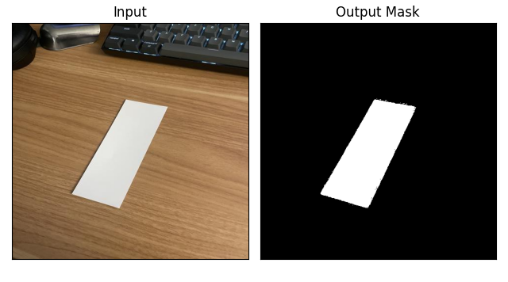

# DocuSegment-Pytorch: UNet Based Document Segmentation in PyTorch. 

<a href="https://pytorch.org/"></a>
<a href="https://www.python.org/"></a>


A custom implementation of the UNet architecture, designed and tuned specifically for the task of binary segmentation of documents and backgrounds.



### **Contents**
- [Usage](#usage)
    - [Training](#training)
    - [Predictions](#predictions)
- [Synthetic Dataset](#synthetic-dataset)
- [Results](#results)
- [Future Work](#future-work)
- [References](#references)

Due to limited data availability, the model is trained on a modified synthetic dataset, more on this [here](#synthetic-dataset). 


## **Usage**

Before you begin, ensure all dependencies are installed
```bash
pip install -r requirements.txt
```


For detailed on the synthetic dataset mentioned earlier, see the [Synthetic Dataset](#synthetic-dataset) section.

If you choose to use your own dataset, the following structure is recommended: 
```
DocuSegment-Pytorch/
├── data/
│    └── <dataset name>/
│           ├── train/
│           │   ├── images/
│           │   └── masks/
│           └── valid/
│               ├── images/
│               └── masks/
├── runs/
│  
├── samples/ 
│  
├── src/
│
⋮
└── README.md
```

You may need to adapt the *DocumentDataset* class in *utils/datasets.py* to suit your custom dataset. 

### **Training**

**Note: Installing CUDA is strongly recommended for on-device training.**

```console
> python -m train -h 
usage: train.py [-h] [-nb N] [-nc N] [-n N] [-lr eta] [-bs b] [-c c] [-sc s] [-d DEVICE] [-tdp path [path ...]] [-vdp path [path ...]] -sn filename [-vbo] [-udi]

options:
  -h, --help            show this help message and exit
  -nb N, --num_blocks N
                        Number of down sampling & upsampling blocks featured in the UNet.
  -nc N, --num_start_channels N
                        Number of channels after the first convolution block.
  -n N, --num_epochs N  Number of epochs.
  -lr eta, --learning_rate eta
                        Learning Rate.
  -bs b, --batch_size b
                        Batch Size.
  -c c, --num_classes c
                        Number of classes
  -sc s, --scale_fact s
                        Factor to reduce / increase the inputs by.
  -d DEVICE, --device DEVICE
                        Device to run model.
  -tdp path [path ...], --train_data_paths path [path ...]
                        Paths of training image and mask directories.
  -vdp path [path ...], --validation_data_paths path [path ...]
                        Paths of validation image and mask directories.
  -sn filename, --save_name filename
                        Same of save file (.pth).
  -vbo, --verbose       Verbose Output.
  -udi, --use_dice_and_iou
                        Add DICE and IoU score to loss during training.
```

Saved models are always stored in the *models/saves* directory, and training results are saved into the *runs* directory. 

### **Inference**
```console
> python -m inference -h
usage: inference.py [-h] -w filename [-inputs path [path ...]] -odir dir [-sc s] [-d DEVICE]

options:
  -h, --help            show this help message and exit
  -w filename, --weight_file filename
                        The saved model's filename.
  -inputs path [path ...], --input_paths path [path ...]
                        Paths to the input(s).
  -odir dir, --output_dir dir
                        Path to Directory where predictions are saved.
  -sc s, --scale_fact s
                        Factor to reduce / increase the inputs by.
  -d DEVICE, --device DEVICE
                        Device to run model.
```
Weight files must be stored in the *models/saves* 


## **Synthetic Dataset**


tehwq


## **Results**

All provided models were trained with the following specifics: 

* Batch Size: 8
* Learning Rate: 0.0003
* Epochs: 50
* scale Factor: 1.5394 


| Model Name | Num Params | Supported Size | Validation DICE | Validation IOU | 
|----|----|----|----|----| 
| unet_16 | 1.9M | 480 x 480 | 0.970725 | 0.945591 | 
| unet_32 | 7.7M | 480 x 480 | 0.981021| 0.960021 |

The '16' and '32' refer to the number of filters in the first convolutionary block.

These models are all available for download via *scripts/downloadWeights.sh*

```bash 
bash scripts/downloadWeights.sh <MODEL NAME> 
```

## **Future Work**

- Flexible BasicDocumentDataset class for easy training on custom datasets 
- Proper Logging instead of printing to stdout
- Config file based experiment setup 
- Checkpointing / Loading and training existing model saves


## **References**

#### Data
* "Preparing Synthetic Dataset For Robust Document Segmentation," LearnOpenCV, Deep Learning-based Document Segmentation Using Semantic Segmentation with DeepLabV3 on a Custom Dataset. [Link](https://learnopencv.com/deep-learning-based-document-segmentation-using-semantic-segmentation-deeplabv3-on-custom-dataset/#Preparing-Synthetic-Dataset-For-Robust-Document-Segmentation)

#### Research

* Olaf Ronneberger, Philipp Fischer, and Thomas Brox, "U-Net: Convolutional Networks for Biomedical Image Segmentation," arXiv preprint arXiv:1505.04597 (2015)​. [Link](https://arxiv.org/abs/1505.04597)

* Ke Ma, Zhixin Shu, Xue Bai, Jue Wang, Dimitris Samaras, "DocUNet: Document Image Unwarping via A Stacked U-Net", Stony Brook University & Megvii Inc.​ [Link](https://www3.cs.stonybrook.edu/~cvl/docunet.html)